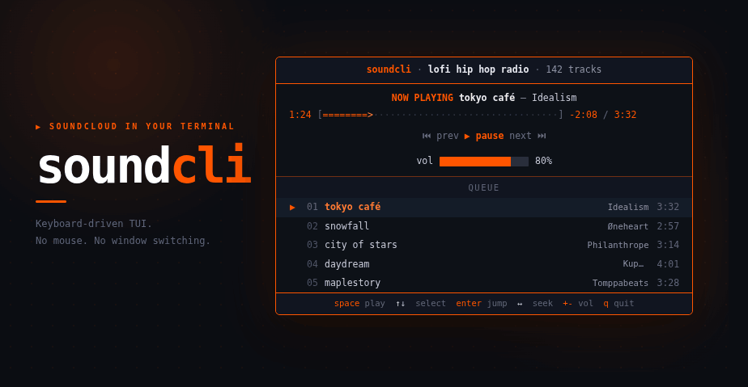

<p align="center">
  
</p>

<p align="center">
  Control SoundCloud from your terminal.
</p>

<p align="center">
  <a href="https://github.com/madzem/soundcli/actions/workflows/ci.yml"></a>
  <a href="LICENSE"></a>
  
</p>

## About

soundcli is a terminal remote control and now-playing dashboard for SoundCloud, written in
Rust ([Ratatui](https://ratatui.rs)). It does not stream audio or remove ads: your
logged-in browser tab plays the music, and soundcli controls it over the OS media bus
(MPRIS / D-Bus) and renders the interface in your terminal.

## Features

- Now-playing dashboard — title, artist, progress bar, play state.
- Full queue — fetched from the set URL; scroll it, select any track, jump with Enter.
- Keyboard-driven — play/pause, next/prev, seek, and volume without leaving the terminal.
- Per-track volume through PipeWire.
- Uses your real browser session, so your account and private or personalized sets work.
- Prebuilt and dependency-light — a single Rust binary; `libdbus` is the only shared library.

## Getting Started

Install on x86_64 Linux:

```sh
curl -fsSL https://raw.githubusercontent.com/madzem/soundcli/main/install.sh | sh
```

Packages (`.deb`, `.rpm`), Homebrew, Cargo, and build-from-source are in
[INSTALL.md](INSTALL.md). soundcli needs a D-Bus session (any standard Linux desktop) and a
browser; PipeWire's `wpctl` is used only for volume.

Run it:

```sh
soundcli --playlist "https://soundcloud.com/<owner>/sets/<name>"
soundcli            # control the SoundCloud tab already playing
soundcli --demo     # sample data, no browser
```

Keys: `space` play/pause, `n`/`p` next/prev, `↑`/`↓` select, `enter` jump, `←`/`→` seek,
`+`/`-` volume, `q` quit.

## How it works

soundcli talks to your browser's SoundCloud tab over the OS media bus (MPRIS / D-Bus),
reading now-playing metadata and sending transport commands. Audio and ads stay in the
browser. To show the upcoming queue it fetches the set's tracklist from SoundCloud's
internal API (metadata only). See [ARCHITECTURE.md](ARCHITECTURE.md) for the design.

## FAQ

**Does it stream music or strip ads?**
No. Playback happens in your normal browser tab — full tracks and ads as usual. soundcli is
a remote control and dashboard, not a player or downloader.

**Do I need Rust installed?**
No. The installer and packages ship a prebuilt binary. Rust is only needed if you build
from source.

**Does it run on macOS or Windows?**
Not yet. It relies on MPRIS / D-Bus, which is Linux. macOS (MediaRemote) and Windows (SMTC)
are possible future work.

**How does it know the full queue?**
Pass a set URL with `--playlist` and it fetches that set's tracklist from SoundCloud's
internal API. Without a URL it shows only the current track.

**My private or personalized set shows no queue.**
Add an `oauth_token` to the config; see [INSTALL.md](INSTALL.md#configuration).

## Contributing

Contributions are welcome — see [CONTRIBUTING.md](CONTRIBUTING.md). Please run
`cargo fmt`, `cargo clippy`, and `cargo test` before opening a pull request.

## License

MIT — see [LICENSE](LICENSE). soundcli is an independent project, not affiliated with
SoundCloud; use it in accordance with
[SoundCloud's Terms of Use](https://soundcloud.com/terms-of-use).
